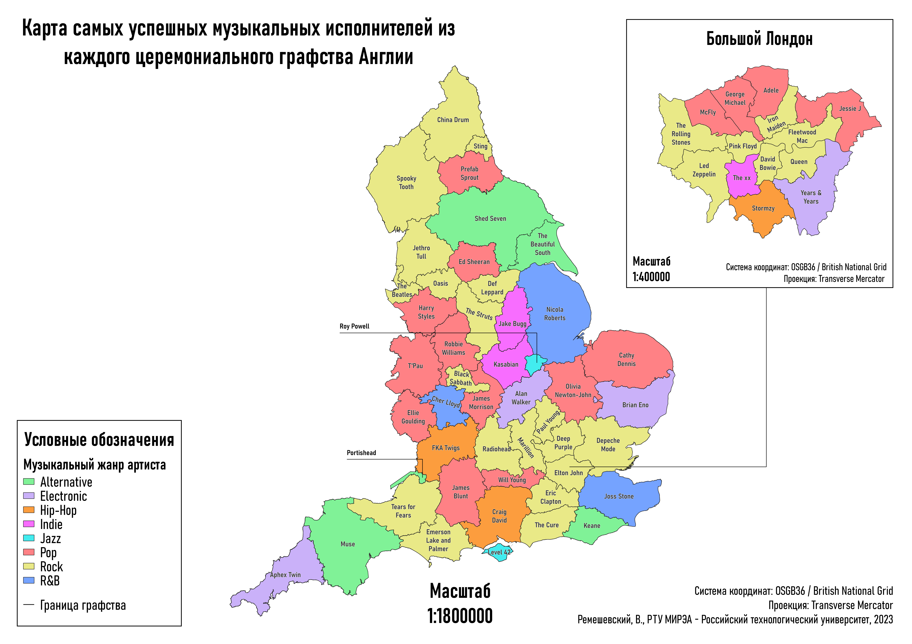

# Map-Of-English-Musicians
This map is dedicated to the most successful musical artists from every ceremonial county of England and London Assembly constituencies. The success of an artist was assessed according to the number of sold copies of the best-selling album from the artist's discography.

The map is designed in the open source QGIS software. The project consists of:
* Vector data with the boundaries of the ceremonial counties of England and the London Assembly constituencies stored in the `data` folder. The data source is the British [Ordnance Survey](https://www.ordnancesurvey.co.uk/products/boundary-line#get)
* QGIS project `UK_Music_Map` with vector data and a map layout. To view/modify the map layout in the QGIS project in the *Project -> Layouts* select the `UK_MusicianOrigin_Map` map layout
* The map layout imported into the **.png** bitmap format

## Map preview

